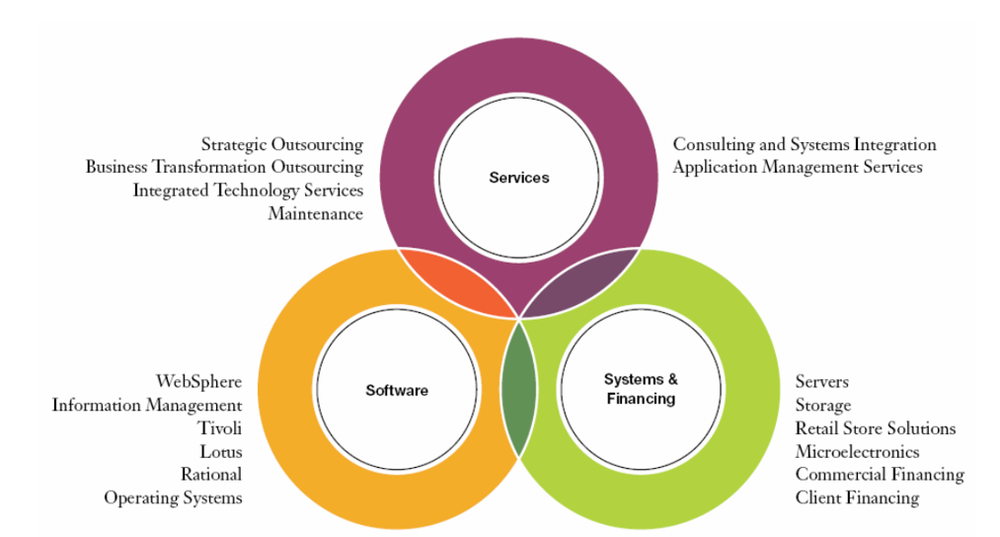
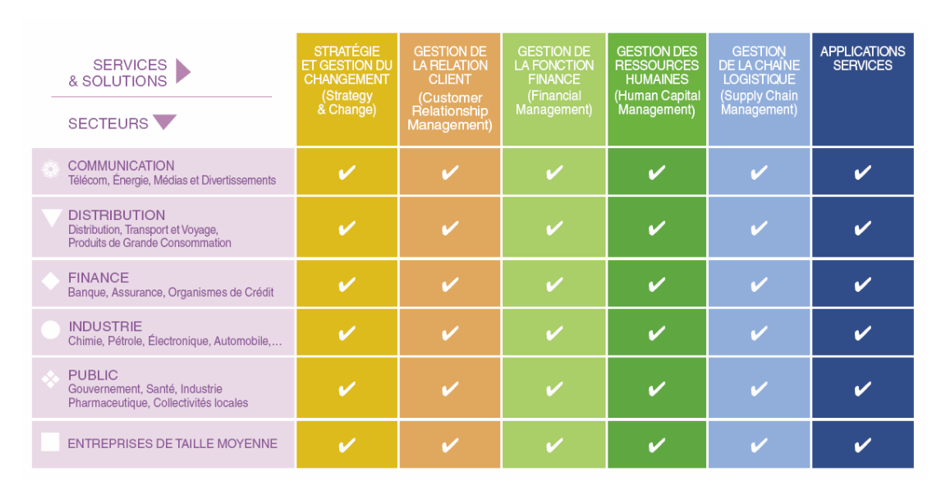
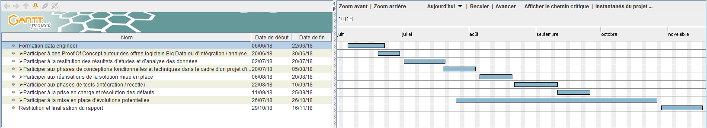

# TFE-IBM-France 
<table border="0">
  <tr>
    <td>
      
    </td>
  </tr>
</table>
<table border="0">
  
  <tr>
    <td>
      
    </td>
  </tr>
  <tr>
    <td align="center">
    </td>
  </tr>
</table>

### Rapport Préliminaire au TFE Intervention fonctionnelle et technique dans le cadre d’une mission de conseil et développement de solutions Big Data et/ou intégration de données

#### Réalisé par :	 
. EL IDRISSI Imane	

#### Tuteur pédagogique : 
. Grégory VIAL

. gregory.vial@ec-lyon.fr

#### Tuteur entreprise :                                                                         
. François BORRY

. fborry@fr.ibm.com

#### Année académique: 2017-2018

## Table des matières:

      .  Introduction

      . 1.	Présentation de IBM France 

      . 1.1.	IBM la société 
      
      . 1.1.1.	Les activités d’IBM
      
      . 1.1.2.	Les chiffres clés
      
      . 1.2.	IBM GBS
      
      . 2.	Objectif du stage et réalisation attendue

      . 3.	Plan du travail prévisionnel
      
      . Conclusion
      
      . Webographie
    
    
    
 ## Introduction
     
Ce présent rapport met l’accent sur la phase de démarrage de notre stage de fin d’étude déroulant chez la société IBM France et ayant débuté le 22 Mai 2018.
Notre stage représente une intervention fonctionnelle et technique dans le cadre d’une mission de conseil et développement de solutions Big Data et/ou intégration de données. Ce premier compte rendu fournit une description de l’étude à mener tous au long de la période du stage. Ainsi, dans sa première partie, nous présentons brièvement l’organisme d’accueil IBM France. Ensuite, nous nous intéressons aux objectifs du stage et au plan prévisionnel durant les 6 mois de cette expérience professionnelle.

## Présentation de IBM France

### 1.1. IBM la société

Le 15 juin 1911, la Computing Tabulating Recording Company (CTR) est née aux Etats Unis, à Endicott dans l'Etat de New York, de la fusion de plusieurs sociétés qui produisent des balances, calculatrices, et machines électro-comptables. En 1924, la CTR devient IBM (International Business Machines). Historiquement, l’activité principale d’IBM a été la construction de matériel informatique, marché dans lequel IBM est devenu leader. Aujourd’hui, suite à une transformation stratégique, IBM est plus orienté vers les services et se positionne comme leader mondial en matière de technologies de l’information.  

   #### 1.1.1.  Les activités d’IBM 

IBM se positionne comme leader en matière de technologies de l’information et le partenaire privilégié des entreprises qui croient à l’innovation comme moteur de croissance. En alignant ainsi les technologies de l’information avec les processus métier, les entreprises améliorent et rationalisent les opérations, mais bénéficient également d’un meilleur retour sur leurs investissements technologiques. IBM met à la disposition des entreprises la palette des ressources la plus complète – compétences, systèmes, logiciels, services, financement, technologies – pour les aider et leur permettre de devenir des entreprises d’innovation.

<table border="0">
  <tr>
    <td>
      
    </td>
  </tr>
  <tr>
    <td align="center">
      <h6> Figure 1 -  IBM Segments and Capabilities (IBM Annual Report 2007) </h6>
    </td>
  </tr>
</table>
Les activités d’IBM peuvent se découper en quatre entités différentes : 

##### IBM Global Services : 
IBM Global services accompagne ses clients dans l’implémentation de solutions innovantes leur permettant d’améliorer les processus entreprise et leur approche du marché. Le chiffre d’affaires d’IGS en 2007 s’élevait à 55,3 Milliards de dollars, soit plus de 50% du CA global d’IBM Corp. (98,8 Milliard de $). IBM Global Services est donc devenue, depuis le rachat de Price Waterhouse Coopers Consulting mi-2002, la branche la plus importante de la compagnie. Cette entité est constituée de deux divisions majeures : 

##### Global Technology Services : 
Des services d’intégration, d’outsourcing et de conseil en architecture IT visant augmenter l’efficacité de l’IT grâce à un plan stratégique et à une architecture technique capable de faire évoluer l’environnement informatique de l’entreprise. 

##### Global Business Services : 
Des services de conseil dans des domaines tels que la finance, la gestion du changement, les ressources humaines, la gestion de la chaîne logistique ou la gestion de la relation client. Avec des consultants présents dans plus de 160 pays, IBM Global Business tktServices fournit à ses clients des prestations de conseil fondées sur son expertise des processus métier et industriels couvrant 17 secteurs d’activité. C’est dans l’entité GBS d’IBM France que s’est déroulé mon stage. 

##### IBM Software Group : 
IBM se positionne comme un acteur majeur de l’édition de logiciels. Voici les logiciels IBM : 
###### IBM Systems Group : 
IBM propose à ses clients des solutions complètes avec serveurs, stockage, applications ainsi que le conseil opérationnel et technique associé. 
###### IBM Global Financing:  
IBM  Global  Financing  propose  à  toute  entreprise un  service  de  location  ou  financement d’équipements  informatique.  L’offre est très large et s’adapte à tous types de projet, de la simple location de matériel à la conception d’opérations sur mesures pour des projets de plus grande ampleur.

#### 1.1.2. Les chiffres clés 

Voici quelques chiffres clés en ce qui concerne l’activité d’IBM : 
-	IBM emploie près de 355.000 personnes et opère dans environ 170 pays. 
-	55,3 milliards de $ de chiffre d’affaires pour la branche conseil et service (IBM Global Services) -> n°1 mondial. 
-	27,5 milliards de $ de chiffre d’affaires pour la branche matériel (software, hardware et serveurs) -> n° 1 mondial.

### 1.2 IBM GBS 

Dernière-née des activités d'IBM, le conseil aux entreprises demeure encore peu connu mais, avec plus de 60 000 collaborateurs présents dans 160 pays, IBM Global Business Services (IBM GBS) est déjà la plus importante entreprise de conseil au monde. IBM Global Business Services fournit, à ses clients, des prestations de conseil liées à la réorganisation et la transformation des processus de l’entreprise et son expertise métier, ainsi que la capacité de traduire cette expertise en solutions et services à la demande, intégrés et flexibles, apportant de la valeur aux entreprises. Les consultants, architectes, managers de projets, ingénieurs d'études et de développement de GBS sont au fait des dernières solutions technologiques et comprennent en profondeur les métiers de leurs clients. Ils puisent dans les capacités d'innovation d'IBM les idées dont ils font bénéficier leurs clients. 
IBM GBS articule trois types d'équipes : les équipes secteurs, les équipes solutions et les équipes applications. Les membres de chacune collaborent sur les projets et participent de bout en bout, de la proposition faite au client à la livraison des résultats attendus et à la capitalisation de l'expérience acquise. 

<table border="0">
  <tr>
    <td>
      
    </td>
  </tr>
  <tr>
    <td align="center">
      <h6> Figure 2 - Services & Solutions IBM GBS </h6>
    </td>
  </tr>
</table>

## Objectifs du stage

Afin d’être toujours à la page avec le développement technologique, IBM France adopte à mettre à disposition de ses clients les services digitaux optimisant leur process et améliorant leur efficacité opérationnelle.

En tant que data ingénieur, notre stage de TFE consiste à participer à la réalisation des missions chez l’un des clients d’IBM.
Pour le moment, nous sommes dans la phase des formations certifiées offertes par IBM qui consistent à consolider les connaissances requises. 

Cependant, l’enjeu est d’adapter les meilleures technologies et de développer des solutions big data afin d’aborder les meilleurs résultats satisfaisant les clients.

Les compétences à envisager durant ce stage sont en grande partie la combinaison des principales compétences des data scientists et les data engineers, aujourd’hui es données sont parmi les actifs les plus précieux des entreprises, notamment pour relever les défis de la fameuse "transformation numérique". Une étude montre en effet que la quasi-totalité des entreprises qui ont engagé un ou plusieurs grands projets de transformation numérique placent la donnée au cœur de leur projet. La prise de conscience est réelle et est de surcroît favorisée par la montée des clouds publics. Les plus grandes entreprises mettent en place des stratégies Datas et recrutent des experts, les Data Scientists, disposant de compétences algorithmiques et statistiques pointue et capables de faire parler les données. 

Savoir les exploiter et les valoriser donne en effet un avantage concurrentiel indéniable pour se démarquer sur son marché. Mais encore faut-il s'assurer que les données exploitées sont fiables, robustes, sécurisées, mais aussi que ce sont les bonnes données qui ont été remontées et qu'elles sont complètes et à jour, ceci dans un contexte où les volumes explosent et les formats sont très hétérogènes.
Ce premier mois était consacré aussi pour améliorer et développer les compétences en : Python, Scala, Spark Hadoop et Hive à travers la manipulation suivante qui consiste à :

-	Ingérer des fichiers de données depuis le edge node vers la raw layer : Créer un ou des modèles de développement Python ou Scala consistant à copier le contenu de fichiers textes depuis une ressource (répertoire) du edge node vers HDFS (zone raw layer), sans transformation fonctionnelle des données mais avec des transformations techniques possibles

-	Alimenter les tables de la conformed layer à partir des fichiers ingérés dans la raw layer

-	Prendre en compte de certaines exigences du GDPR : Anonymiser / Pseudonymiser et Protéger l’accès à certaines tables et/ou colonnes de tables

-	Automatiser les traitements

En outre, durant les 5 mois de stage qui arrivent, nous serons menées à effectuer différentes tâches :

	Participer à des Proof Of Concept autour des offres logiciels Big Data ou d’intégration / analyse de données

	Participer à la restitution des résultats d’études et d’analyse des données

	Participer aux phases de conceptions fonctionnelles et techniques dans le cadre d’un projet d’intégration

	Participer aux réalisations de la solution mise en place

	Participer aux phases de tests (intégration / recette)

	Participer à la prise en charge et résolution des défauts

	Participer à la mise en place d’évolutions potentielles

## Plan du travail prévisionnel

Ci-dessous un schéma de Gantt qui résume le plan prévisionnel pour les 5 prochains mois à venir concernant ma mission est achevée au 20 juin 2018. 
Les tâches prévues pour les 5 mois prochains peuvent évoluer en fonction des demandes des clients.

 <table border="0">
  <tr>
    <td>
      
    </td>
  </tr>
  <tr>
    <td align="center">
      <h6> Figure 3 - Diagramme de Gantt </h6>
    </td>
  </tr>
</table>

## Conclusion

La formation proposée par IBM représente le profil data ingénieur qui est très demandé, ce qui aboutir à la rechercher des personnes qui ont ce profil afin de contribuer à la construction des projets des clients d’IBM. Et dans ce cadre-là se situe notre stage de TFE.

Notre sujet de stage n’est pas encore défini : les technologies de développement sont listées et déterminées. L’accueil IBM France a été effectué et le stage a été bien démarré dès les premiers jours avec une journée d’intégration bien organisée, avec des réunions avec notre maître de stage qui nous a mis dans le cadre de travail. Le stage chez IBM Analytics est très intéressant, passionnant et enrichissant avec une très bonne ambiance de travail.

## Webographie

[1]	http://www.01net.com/telecharger/windows/Bureautique/organiseurs/fiches/29021.html
[2]	https://www.ibm.com/fr-fr/
[3]	https://www.decideo.fr/Le-data-engineering-complement-indispensable-de-la-data-science_a10085.html
[4]	https://www.ibm.com/analytics/fr/fr/technology/ibm-bigdataparis.html
 

## Auteur:
#### EL IDRISSI Imane

